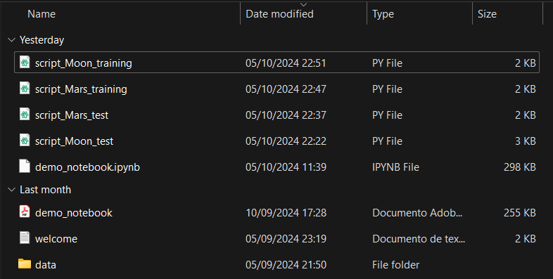
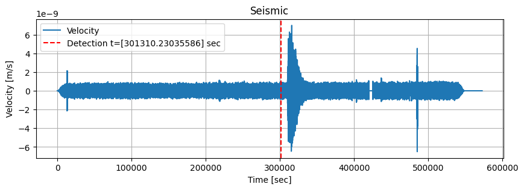

# Seismic Detection

## Installation
You should dowload the data folder from "Data Dowload.txt" and install the requirements from requirements.txt

## What is it for?
It helps to recognize seismic events from other planets/satellites to reduce the energy needed to send this data back to earth.

## Data preparation before model training:
We needed to supply the model with the data, containing the velocity values of all seismic recording.

This data was normalized and filtered to create a spectogram using the frequencies.

## Model creation
We created a CNN (Convolutional Neural Network) model to predict the beggining of the seismic.
We split the data into 76% for training and 24% for testing.

## Model arquitecture:
Convolutional Layer with 32 filters
Convolutional Layer with 64 filters
Convolutional Layer with 128 filters
Dense Layer with 128 neurons and relu activation
Dense Layer with 1 neuron (prediction neuron)

# Prediction example

## Challenges encountered
We count with little individual seismic data and a enormous amount of data for each (we only have 76 examples for the lunar data). This is not optimal, as for the model the more seismic data the best, but also for the matrix creation.
A intermediate optimization could be reducing the resolution, eliminating half
the velocity data. This would have a negligible impact on the result and a great improvement
in processing times.
